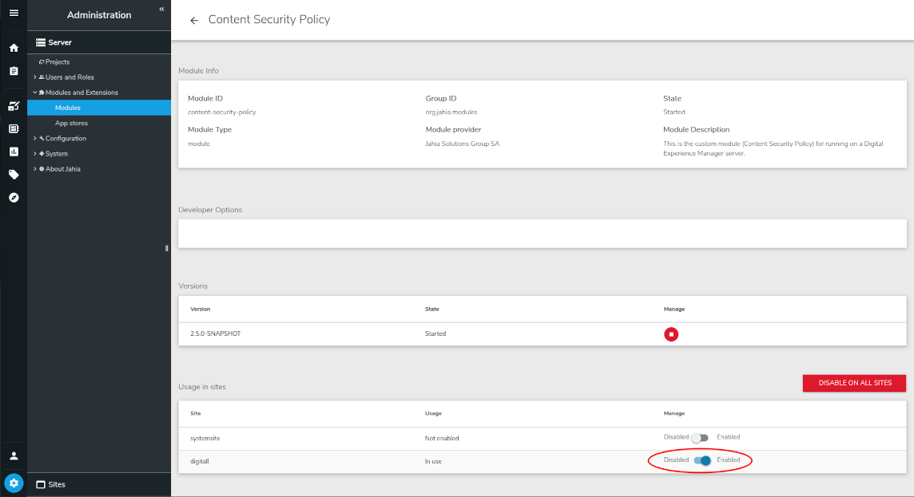

---
page:
  $path: /sites/academy/home/documentation/jahia/8_2/developer/cms-security/content-security-policy
  jcr:title: Jahia Content Security Policy
  j:templateName: documentation
content:
  $subpath: document-area/content
---

### Overview

The purpose of this module is to allow the definition of a Content Security Policy for a website inside Jahia. For more information about the Content Security Policy, please refer to this URL: https://developer.mozilla.org/en-US/docs/Web/HTTP/Headers/Content-Security-Policy

### Installation

Module is installed by default with Jahia 8+ versions, but you have to enable it for your site.

1. In Jahia, go to "Administration -> Server -> Modules & Extensions -> Modules"
2. Locate the module "Content Security Policy" and click on it
    
   
3. Activate the module on the relevant sites. 

Once enabled, you can define a Content Security Policy at the site level or for a specific page.

#### Define a Content Security Policy at the site level

1. In Jahia, go to "Administration --> Sites --> Site properties --> Edit site properties"
2. In the Options section, check the box "Add Content-Security-Policy at the site level"
   
   
3. Fill the text area with your Content Security Policy (on one line)
4. You can check the box "Only report CSP violations" to only log the violations in the Jahia log files
5. You can provide a specific URL for receiving the violation reports (instead of the default jahia action to warn in the log files)

#### Define a Content Security Policy for a specific page

1. In Jahia, got to "JContent -> Edit page"
2. In the Options section, check the box "Replace Content-Security-Policy at the page level"
    
   
3. Fill the text area with your Content Security Policy (on one line)

### Example of a Content Security Policy
```http
Content-Security-Policy: default-src 'self'; script-src 'self' https://apis.google.com; object-src 'none'; frame-ancestors 'none';
```

### Example of a strict Content Security Policy
```http
Content-Security-Policy: 
default-src 'self' https://*.doubleclick.net; 
script-src 'nonce-' 'strict-dynamic' https: 'unsafe-inline'; 
object-src 'none'; 
base-uri 'none'; 
frame-ancestors 'none'; 
img-src 'self' data:; 
font-src 'self' data:; 
style-src 'self' 'unsafe-inline';
frame-src 'self' https://*.googletagmanager.com https://*.google-analytics.com https://*.doubleclick.net https://*.googlesyndication.com;
connect-src 'self' https://*.google-analytics.com https://*.googletagmanager.com https://*.doubleclick.net https://*.googlesyndication.com;
```
The 'nonce-' is a placeholder for a nonce value that should be generated for each request.

### How to only report the CSP violations during a test phase?

:::info
This option is only available at the site level configuration.
:::
You have to check the box Only report CSP violations, and the violations will be logged in the Jahia log files or sent to the URL provided in the field Report violations to this URL.

### How to report the CSP violations to a specific URL?

:::info
This option is only available at the site level configuration.
:::
You have to provide the URL in the field Report violations to this URL.

### How to generate the nonce value?

In your custom module, you have to set the value of the attribute nonce to the value of the Jahia property `contentSecurityPolicy.nonce.placeHolder`
The value of your CSP, at the site level, has to contain the string nonce-.
Then for each page rendering, a random value will be generated and:
- will update the CSP for the page
- will replace in the HTML code the static value of the nonce
This way, a potential hacker should not be able to bypass this security.

## Resources
- [Content Security Policy - MDN Web Docs](https://developer.mozilla.org/en-US/docs/Web/HTTP/CSP)
- [Content Security Policy - Reference](https://content-security-policy.com/)
- [OWASP Content Security Policy Cheat Sheet](https://cheatsheetseries.owasp.org/cheatsheets/Content_Security_Policy_Cheat_Sheet.html)
- [Content Security Policy - Google Developers](https://web.dev/articles/csp)
- [Lighthouse - Content Security Policy](https://developer.chrome.com/docs/lighthouse/best-practices/csp-xss)
